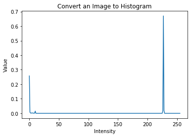
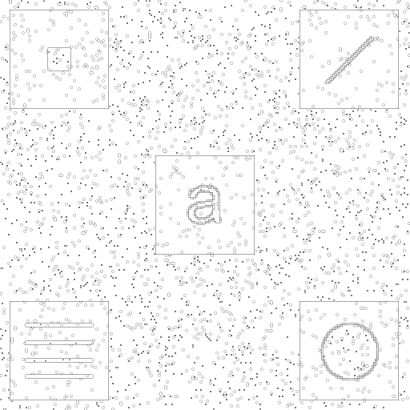
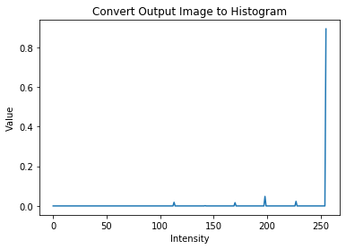
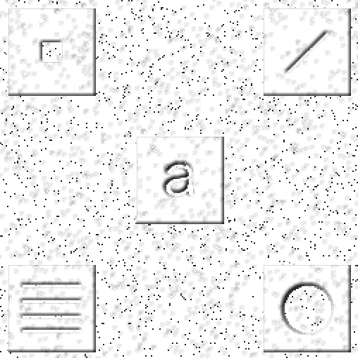
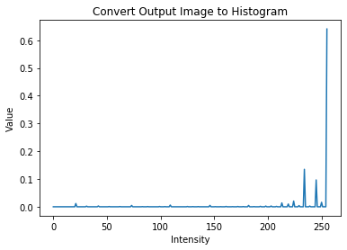

# Local Histogram Equalization
Robust Local Histogram Equalization written from scratch

<a href="https://en.wikipedia.org/wiki/Histogram_equalization">Histogram Equalization</a> is a method in image processing of contrast manipulation using an image's histogram. 
A histogram is nothing but the probability distribution of its intensity values. This can be represented as a probability density function, pdf.
Using this idea, we can manipulate the intensity value of an image using its corresponding histogram value. 

There are two types of histogram equalization techniques, local and global. A global histogram equalization deals with manipulation of pixel values without
the consultation of any neighbors. What this means is that the output intensity is a function of just the input value and the corresponding transformation function.
On the other hand, a local histogram equalization considers neigboring pixels and creates a CDF (cumaltive density function) based approximating for the resulting
intensity.

# Demo:

## Input Picture:

### Histogram

## Local Histogram Equalization with kernel = 3

### Output Histogram

## Local Histogram Equalization with kernel = 7

### Output Histogram

# Run the [Colab](https://colab.research.google.com/drive/1UCgTdZMaFBSUlPakZFovCZ33bEMxJdo8) version to Reproduce results
